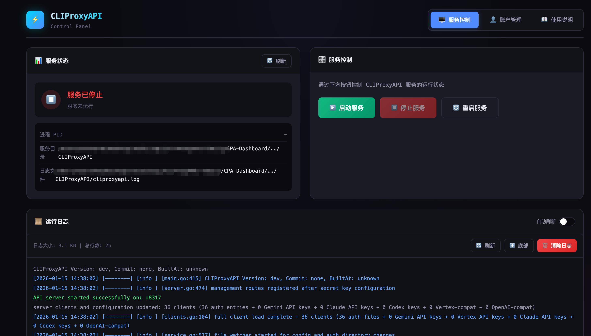
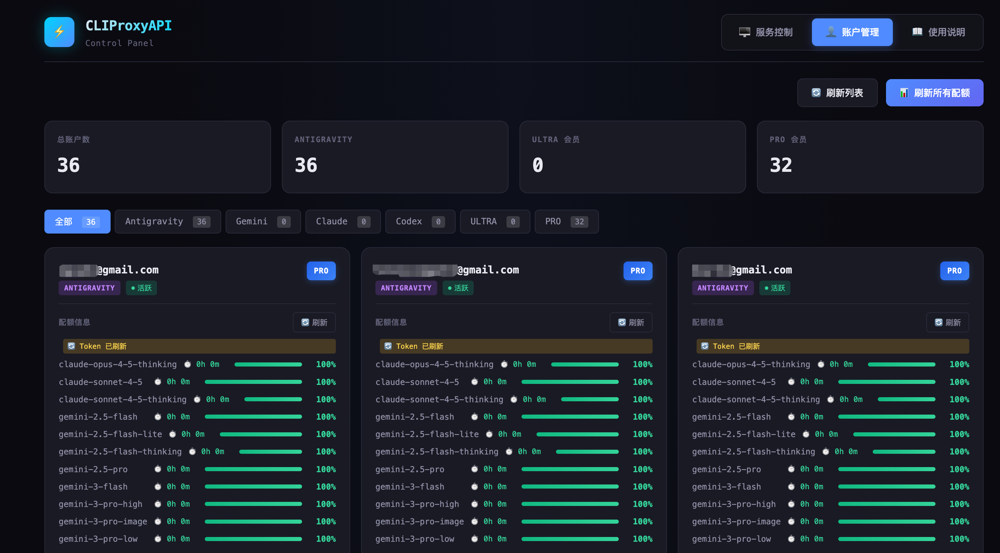
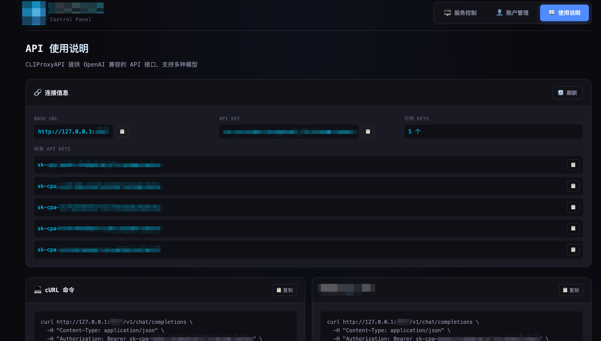

# CPA-Dashboard

CLIProxyAPI 控制面板 - 服务管理与账户监控 Web 界面。

## 功能

### 服务控制
- 启动 / 停止 / 重启 CLIProxyAPI 服务
- 实时查看服务运行状态（PID、运行目录等）
- 查看运行日志（支持语法高亮、自动刷新）
- 清除日志文件

### 账户管理
- 显示所有账户列表
- 显示账户类型（antigravity/gemini/claude/codex 等）
- 显示会员等级（ULTRA/PRO/FREE）
- 显示每个模型的配额百分比及重置倒计时
- 配额缓存持久化（重启后保留）
- 单个账户配额刷新
- 批量并行刷新所有账户配额（并行度 4）
- 按类型/会员等级筛选
- **添加账户**：通过 OAuth 登录添加新账户（支持 Antigravity/Gemini/Codex/Claude/Qwen/iFlow）
- **删除账户**：删除指定账户（带确认对话框）

## 安装

```bash
pip install -r requirements.txt
```

## 使用

### 方式一：直接运行
```bash
python app.py
```

### 方式二：通过启动脚本
```bash
# 在 CPA-Dashboard 目录下
./start.sh

```

默认访问 http://127.0.0.1:5000

## 配置

程序会自动从环境变量或父目录查找 `config.yaml` 读取配置：
- `port` - CLIProxyAPI 端口
- `auth-dir` - 认证文件目录

环境变量：
| 变量 | 说明 | 默认值 |
|------|------|--------|
| `CPA_CONFIG_PATH` | config.yaml 绝对路径 | 自动查找 |
| `CPA_SERVICE_DIR` | CLIProxyAPI 服务目录 | 从 config 路径推导 |
| `CPA_BINARY_NAME` | 可执行文件名 | `CLIProxyAPI` |
| `CPA_LOG_FILE` | 日志文件路径 | `cliproxyapi.log` |
| `CPA_MANAGEMENT_URL` | Management API 地址 | `http://127.0.0.1:{port}` |
| `CPA_MANAGEMENT_KEY` | Management API 密钥 | - |
| `WEBUI_HOST` | WebUI 监听地址 | `127.0.0.1` |
| `WEBUI_PORT` | WebUI 端口 | `5000` |

## 运行模式

1. **本地模式**（默认）：直接读取 auth 目录中的 JSON 文件
2. **API 模式**：设置 `CPA_MANAGEMENT_KEY` 后通过 Management API 获取数据

## 界面说明

### 服务控制



服务控制页面提供以下功能：

- **服务状态**：实时显示 CLIProxyAPI 服务的运行状态
  - 绿色表示服务正在运行，红色表示服务已停止
  - 显示进程 PID、服务目录、日志文件路径等详细信息
- **服务控制**：通过按钮一键操作
  - 🟢 启动服务 - 启动 CLIProxyAPI
  - 🟠 停止服务 - 停止运行中的服务
  - 🔵 重启服务 - 重新启动服务
- **运行日志**：查看服务运行日志
  - 支持自动刷新（开关控制）
  - 手动刷新、跳转底部、清除日志

### 账户管理



账户管理页面提供以下功能：

- **统计概览**：顶部显示账户统计信息
  - 总账户数、各类型账户数量
  - ULTRA/PRO 会员数量统计
- **筛选功能**：按条件筛选账户
  - 按类型：全部、Antigravity、Gemini、Claude、Codex
  - 按等级：ULTRA、PRO
- **账户卡片**：每个账户显示为一张卡片
  - 账户邮箱、类型标签、会员等级
  - 账户状态（活跃/沉默）
  - 配额信息：各模型的使用百分比及重置倒计时
- **操作按钮**：
  - 添加账户 - 通过 OAuth 登录添加新账户
  - 刷新列表 - 重新加载账户列表
  - 刷新所有配额 - 批量并行刷新所有账户的配额信息
  - 单个账户刷新 - 点击卡片上的刷新按钮
  - 删除账户 - 点击卡片上的删除按钮（带确认对话框）

### 添加账户

添加账户支持以下 Provider：

| Provider | 说明 | 回调端口 |
|----------|------|----------|
| Antigravity | Google Antigravity 账户 | 51121 |
| Gemini CLI | Google Gemini CLI 账户 | 8085 |
| Codex | OpenAI Codex 账户 | 1455 |
| Claude | Anthropic Claude 账户 | 54545 |
| Qwen | 通义千问账户 | 设备码模式 |
| iFlow | iFlow 账户 | 55998 |

**远程服务器使用提示**：

如果 CLIProxyAPI 运行在远程服务器上，需要设置 SSH 端口转发：

```bash
# 以 Antigravity 为例
ssh -L 51121:localhost:51121 user@server
```

然后在本地浏览器中完成 OAuth 认证。

### 使用说明



使用说明页面展示 API 连接信息：

- **连接信息**：
  - BASE URL - API 服务地址
  - API KEY - 当前使用的密钥
  - 可用 KEYS - 可用密钥数量
- **所有 API KEYS**：列出所有可用的 API 密钥，点击复制
- **cURL 命令**：提供现成的 cURL 命令示例，可直接复制使用

## 注意

- 配额查询目前仅支持 Antigravity 类型账户（实时配额 + 模型别名与 CLIProxyAPI 一致）
- 其他类型账户（Gemini/Codex/Claude/Qwen/iFlow/AI Studio/Vertex）显示静态支持的模型列表，与 CLIProxyAPI `internal/registry/model_definitions_static_data.go` 保持同步
- 服务控制功能需要正确配置 `CPA_SERVICE_DIR`
